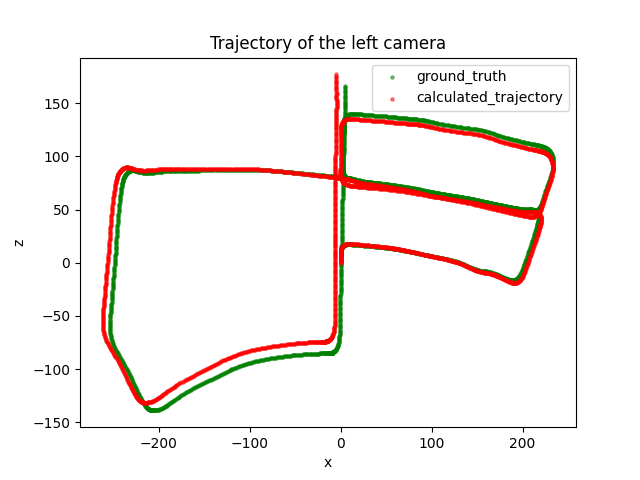

# SLAM Project
Video Navigation.

Submitted By: Dor Messica, Ron Kobrowski.

## Introduct
ion
In this projec t we will implement a SLAM algorithm, when SLAM stands for "Simultaneous, Localization and Mapping".
This means that we will create a map of the environment, and at the same time we will localize ourselves in the map.

The project will be devided to 7 exercises, where we will gradually develop a largescale project that employs a suite of algorithms to provide local visual odometry and global trajectory estimation. Simply put, we will find the vehicle locations using only its cameras. The system will run on the KITTI stereo dataset and will tackle these challenges using image processing, image understanding and 3D optimization techniques to estimate the vehicle path and the geometric structure of the world.
In this project, we will make an extensive use of opencv (mainly for features extraction and matching) and gtsam (for factor and pose graphs).

## Ex1
In this exercise we will develop the feature-tracking system, which is a key-component in any vision-based navigation system. Basically, the feature-tracking system receives as input a series of images (or, in our case, stereo pairs) and outputs trajectories of points in the image, where each track represents the different pixel locations of a certain object in the scene.

here are the basic features as we extracted them from the first frame:

and here are the matches between the first frame and the second frame:

and here are the matches after we applied a significance test:

## Ex2
In this exercise we explore a geometric outlier rejection policy and use the stereo matches for triangulation to produce a 3D point cloud.

## Ex3
In this exercise we will move forward in time to the next stereo pair and match the left image to the previous left image and run PnP using RANSAC iterations to estimate the relative motion. We will also use the extra information - we now have two stereo pairs - to reject (almost all of) the remaining outliers.

we can calculate the relative motion between the two frames using PnP and RANSAC iterations, 
and estimate the transformation between the two frames:
`ENTER ESTIMATION CALCULATION`

then, we are able to make an initial estimate for the trajectory of the vehicle:

## Ex4
In this exercise we extend the feature tracking across multiple frames and implement a suitable database for the tracked features. We use the matches we got in exercise 3 with careful bookkeeping to keep track (no pun intended) of which feature was tracked across what frame. This information will be important in future stages when we will build the Bundle Adjustment / Loop Closure optimization.

## Ex5
In this exercise we run bundle adjustment to leverage the information across multiple images as well as taking a probabilistic approach to the problem. The results of the previous exercises will be used as initial starting point for the bundle optimization.
To keep the computation cost down we will run the optimization on small segments of consecutive images. We use the GTSAM optimization library to handle the mathematical details of the process.
The result of the computation is an accurate estimation of the local trajectory of the vehicle and can be used as Visual Odometry.

## Ex6
Previously, We solved small Bundle Adjustment problems and used the results to calculate relative transformations between consecutive keyframes.
These relative poses can be used as constraints for a factor graph optimization problem we call Pose The pose graph is used to keep a concise summary of the trajectory.
It consists of the poses of some of the frames (keyframes) and the relative nonlinear pose constraints between them. Since it contains no
reprojection constraints (only pose-pose constraints) and only a subset of the frame poses it is a very concise representation of the entire trajectory.
In this exercise we prepare for implementing Loop Closure, by extracting relative pose constraint from Bundle optimization and building the Pose Graph.

here is a visualization of the poses and covariances of the poses in the scene:

## Ex7
In this exercise, we will recognize that the current location of the vehicle is potentially similar to some past location and initiate a search for the exact relative pose between two frames.
When we find such connection to a past frame, we’ll use it to add a Loop Closure constraint to the pose graph, thus greatly reducing the drift of the trajectory estimation.

here is one successful loop closure consensus match:

That made a huge difference to the location uncertainty:

A comparison of the location uncertainty before and after loop closure:

## Final Project
Over the past exercises we implemented a system that estimates the trajectory of the vehicle from a video captured with an onboard stereo camera.
The system uses a suite of algorithms in several stages to achieve this goal. In the final project report we present the different parts of the system, explore their properties and the quality of the estimation.
Moreover, we will present in our own words the different stages of the system, and summarize the ideas and algorithms as we comprehend them.
We will present graphs, figures and statistic that demonstrates the performance of the different stages of the system as well as the system as a whole.
For each graph, we provide an analysis of the information presented in the graph, highlight what the graph shows and explain what aspect (positive or negative) it demonstrates.

some of the results we got:

and here is the entire trajectory with all the loop closures:
you can really see the improvement in the trajectory estimation! 

and only the moving car:

